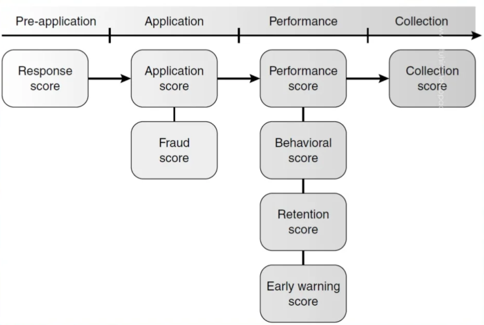

# EDUCATION: Creating Credit Scorecards (Classic Logistic Regression)

## Назначение Репозитория

Данный репозиторий посвящен теме создания классических **Кредитных скоринговых карт** на основе **Логистической регрессии** при помощи пакетов на языке программирования [**R**](https://www.r-project.org).

Обзор материалов на языке программирования на **R** представлен в работе Gero Szepannek. [_An Overview on the Landscape of R Packages for Open Source Scorecard Modelling_](https://www.mdpi.com/2227-9091/10/3/67).

### Пакеты используемые для построения кредитных скоринговых карт на языке программирования R

На 2022 год существует несколько пакетов для построения кредитных скоринговых карт на языке программирования R с высоким уровнем цитирования и большим числом загрузок.

Их можно разделить на две группы по тому какой класс предикторов применятся для построения: 

* факторы в терминалогии **R**, т.е. [(номинальные или качественные признаки, англ. categorical variables)](https://ru.wikipedia.org/wiki/%D0%9A%D0%B0%D1%87%D0%B5%D1%81%D1%82%D0%B2%D0%B5%D0%BD%D0%BD%D0%B0%D1%8F_%D0%BF%D0%B5%D1%80%D0%B5%D0%BC%D0%B5%D0%BD%D0%BD%D0%B0%D1%8F), что дает лучшее пониманию бизнеса процесса построения модели;

* уровни [непрерывных числовых признаков (англ. Continuous variable)](https://en.wikipedia.org/wiki/Continuous_or_discrete_variable#Continuous_variable).

### В **первую группу**, использующие предикторы, преобразованные в **факторы**, входят:

1. Самый популярный пакет [**`smbinning`: Scoring Modeling and Optimal Binning**](http://cran.rstudio.com/web/packages/smbinning)    , созданный чилийцем **Herman Jopia**.

> A set of functions to build a scoring model from beginning to end, leading the user to follow an efficient and organized development process, reducing significantly the time pent on data exploration, variable selection, feature engineering, binning and model selection  among other recurrent tasks. 

> The package also incorporates monotonic and customized binning, scaling capabilities that transforms logistic coefficients into points for a better business understanding and calculates and visualizes classic performance metrics of a classification model.

> The references including:

* Anderson R. [(2007, ISBN: 9780199226405)](https://www.amazon.com/Credit-Scoring-Toolkit-Management-Automation/dp/0199226407) _The Credit Scoring Toolkit: Theory and Practice for Retail Credit Risk Management and Decision Automation_.

* Finlay S. [(2010. ISBN: )](https://www.amazon.com/Credit-Scoring-Response-Modeling-Insurance-ebook/dp/B008RWZFKI) _Credit Scoring, Response Modeling, and Insurance Rating_.

2. Пакет для преобразования данных и построения скоринговых карт [**`Rprofet`: WOE Transformation and Scorecard Builder**](http://cran.rstudio.com/web/packages/Rprofet)    , разработанный командой Государственного Университета Южной Дакоты, под руководством **Thomas Brandenburger**.
  
> Performs all steps in the credit scoring process. This package allows the user to follow all the necessary steps for building an effective scorecard. It provides the user functions for coarse binning of variables, Weights of Evidence (WOE) transformation, variable clustering, custom binning, visualization, and scaling of logistic regression coefficients. The results will generate a scorecard that can be used as an effective credit scoring tool to evaluate risk. For complete details on the credit scoring process, see:

* Siddiqi, N. [(2006, ISBN: 9780471754510)](https://www.amazon.com/Intelligent-Credit-Scoring-Implementing-Scorecards/dp/1119279151). _Credit risk scorecards. Developing and Implementing Intelligent Credit Scoring_.
  
### **Вторая группа** с применение уровней непрерывных переменных, которая не дает явного представления для бизнес-заказчиков, содержит:

2. Пакет для построения кредитных скоринговых карт [**`scorecard`: Credit Risk Scorecard**](http://cran.rstudio.com/web/packages/scorecard)   , разработанный китайцем  **Shichen Xie**.

> The `scorecard` package makes the development of credit risk scorecard easier and efficient by providing functions for some common tasks, such as data partition, variable selection, woe binning, scorecard scaling, performance evaluation and report generation. These functions can also used in the development of machine learning models.
    The references including: 
    
* Refaat, M. [(2011, ISBN: 978144751119)](https://www.amazon.com/Credit-Risk-Scorecards-Development-Implementation/dp/1447511190). _Credit Risk Scorecard: Development and Implementation Using SAS_. 
  
* Siddiqi, N. [(2006, ISBN: 9780471754510)](https://www.amazon.com/Intelligent-Credit-Scoring-Implementing-Scorecards/dp/1119279151). _Credit risk scorecards. Developing and Implementing Intelligent Credit Scoring_.
  
3. Пакет для дискретизации или квантования (англ. [Binning](https://en.wikipedia.org/wiki/Data_binning)) номинальных и числовых переменных [**`woeBinning`: Supervised Weight of Evidence Binning of Numeric Variables and Factors**](http://cran.rstudio.com/web/packages/woeBinning)   , разработанный немцем  **Thilo Eichenberg**.

> Implements an automated binning of numeric variables and factors with respect to a dichotomous target variable.
 
> Two approaches are provided: An implementation of fine and coarse classing that  merges granular classes and levels step by step. And a tree-like approach that  iteratively segments the initial bins via binary splits. Both procedures merge,
 respectively split, bins based on similar weight of evidence (WOE) values and  stop via an information value (IV) based criteria.

> The package can be used with single variables or an entire data frame. It provides  flexible tools for exploring different binning solutions and for deploying them to(new) data.

1. Интерактивный построитель кредитных скоринговых карт [**`scorecardbuilder`**](https://github.com/anindyamozumdar/scorecardbuilder), созданный индусом **Anindya Mozumdar** в 2019 г., победитель [Первого конкурса контента для Shiny](https://blog.rstudio.com/2019/04/05/first-shiny-contest-winners).

> This application is a Web-based interface to develop credit risk scorecards. It is a fairly basic application but works for simple use cases. It supports: Data Upload, Exploratory Data Analysis, Sampling, Binning (Weight of Evidence and Information Value calculation), Scorecard Development and Alignment and Scorecard Validation
